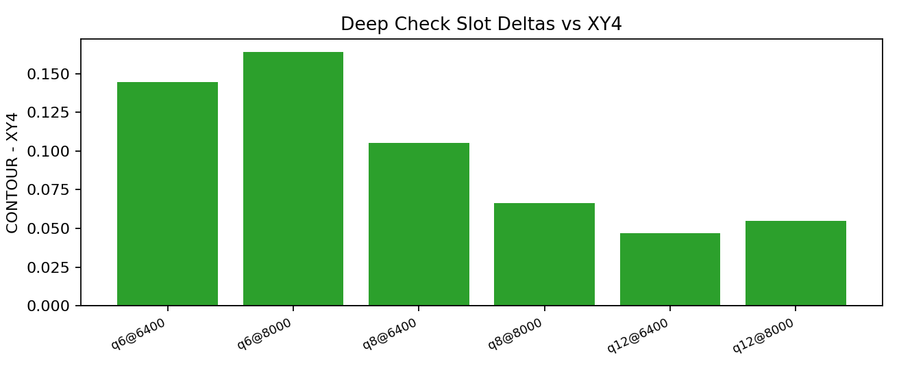
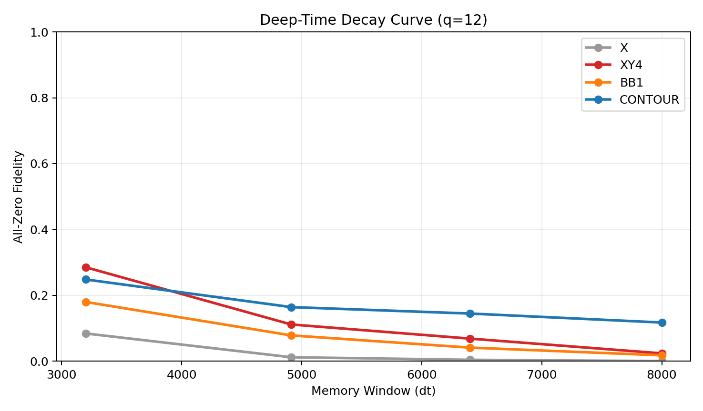
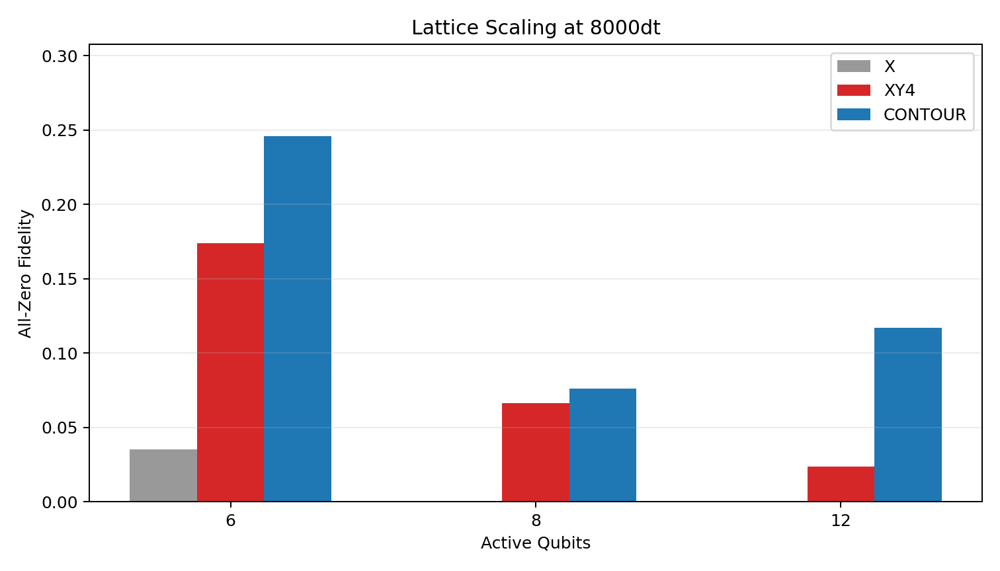
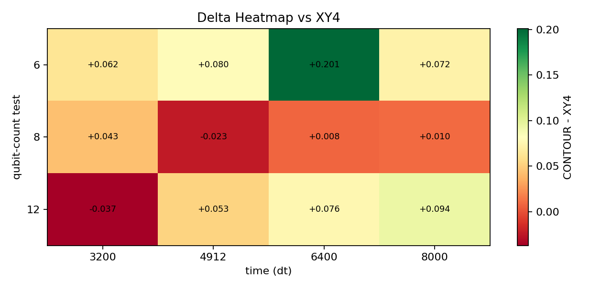
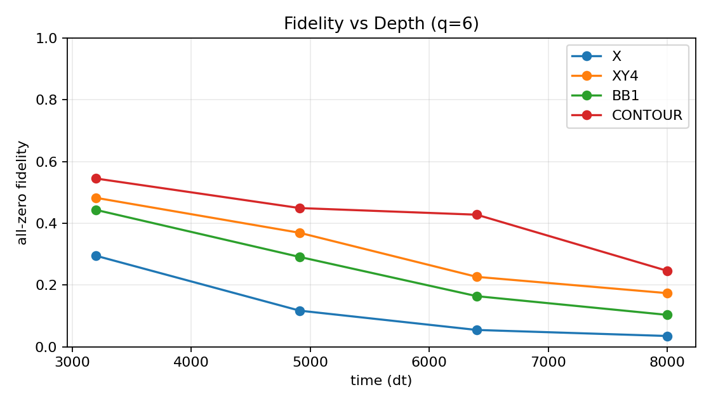
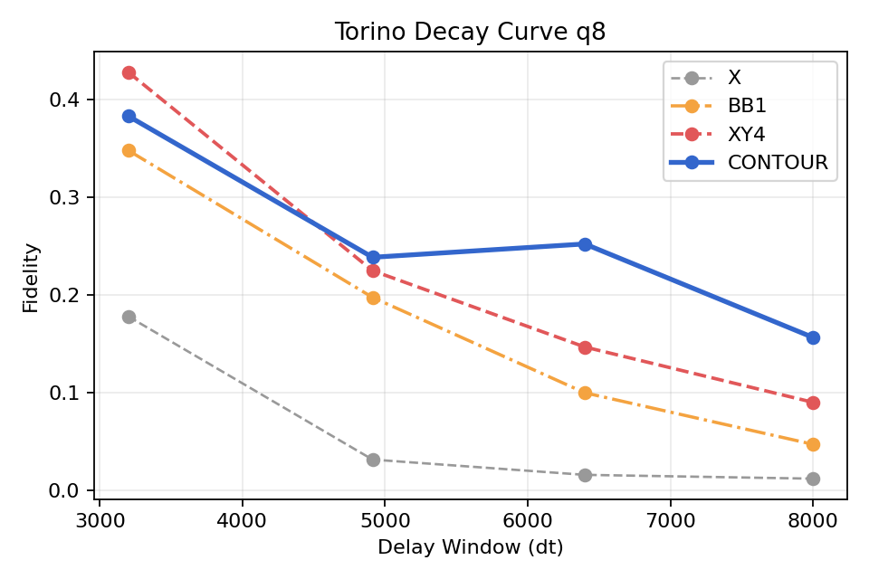
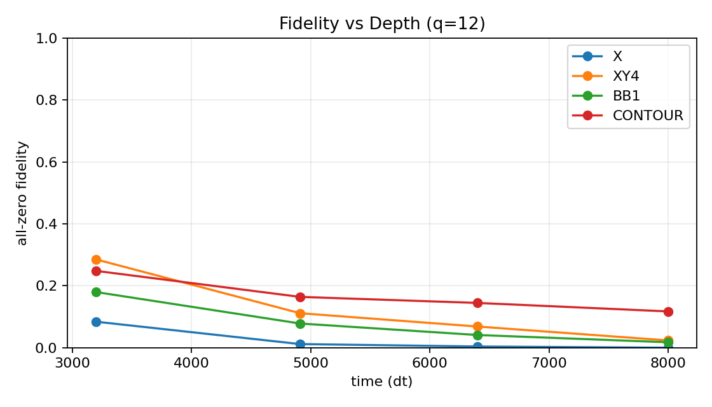

# CONTOUR: Enterprise Quantum Error Suppression

**CONTOUR** (Continuous Topological Phase Surfer) is a proprietary, deterministic quantum compiler for suppressing deep-time decoherence and lattice crosstalk on superconducting processors.

CONTOUR is designed for low-latency operation and benchmarked against standard dynamic decoupling baselines (`X`, `XY4`, `BB1`) on IBM heavy-hex hardware.

> This repository is the **public benchmark showcase** only.  
> The core CONTOUR transpilation engine and calibration daemon are proprietary commercial IP.

---

## Approach (High-Level)

CONTOUR is an adaptive, hardware-aware suppression stack that:

1. Uses calibration-derived signals to adapt control intensity by regime.
2. Applies topology-aware coordination to reduce interference at scale.
3. Runs as a deterministic low-latency runtime layer suitable for production workflows.

Detailed actuator math, scheduling policy, and calibration logic are intentionally withheld.

---

## Benchmark Results (IBM Torino)

Evaluation matrix:
- Lattice sizes: Q6, Q8, Q12
- Memory windows: 3200dt, 4912dt, 6400dt, 8000dt
- Baselines: `X`, `XY4`, `BB1`

Primary artifact:
- `data/torino/validation3_torino_full_paritylift_aggregate_today.json`

### Latest Deep Validation (Today)

Deep-only confirmation rerun (`6400dt`, `8000dt`) across Q6/Q8/Q12:
- Artifact: `data/torino/validation3_torino_deep_aggregate_today2.json`
- **vs X:** 6 / 6 wins (`+0.1465` mean absolute gain)
- **vs BB1:** 6 / 6 wins (`+0.0944` mean absolute gain)
- **vs XY4:** 6 / 6 wins (`+0.0423` mean absolute gain)

Detailed deep slot table:
- `docs/deep_check_today2.md`

### Cross-Backend Deep Validation (Today5)

Deep-only run (`6400dt`, `8000dt`) across Q6/Q8/Q12 on both IBM backends:

- Marrakesh aggregate: `data/marrakesh/validation3_marrakesh_deep_aggregate_today5.json`
  - vs X: 6/6
  - vs BB1: 6/6
  - vs XY4: 5/6 (`mean dXY4 = +0.0469`)
  - non-win slot: `q8 @ 6400dt` (`dXY4 = -0.0273`)
- Torino aggregate: `data/torino/validation3_torino_deep_aggregate_today5.json`
  - vs X: 6/6
  - vs BB1: 6/6
  - vs XY4: 5/6 (`mean dXY4 = +0.0605`)
  - non-win slot: `q8 @ 8000dt` (`dXY4 = -0.0273`)

Cross-backend summary and pulse-level firing metadata:
- `data/validation3_cross_backend_deep_today5.json`
- `docs/deep_check_today5.md`

### Marrakesh Deep Validation (Today6)

Marrakesh-only deep rerun (`6400dt`, `8000dt`) across Q6/Q8/Q12:
- Aggregate: `data/marrakesh/validation3_marrakesh_deep_aggregate_today6.json`
- vs X: 6/6, vs BB1: 6/6, vs XY4: 5/6 (`mean dXY4 = +0.0677`)
- Detailed note: `docs/marrakesh_deep_today6.md`

Quick links:
- Slot table: `docs/torino_table.md`
- Deep-time curve: `docs/figures/deep_time_decay_curve.png`
- Scaling chart: `docs/figures/lattice_scaling_bar_chart.png`
- Delta heatmap: `docs/figures/heatmap_dxy4.png`

### Deep-Time Rescue at 8000dt

| Lattice Density | XY4 Baseline | CONTOUR | Relative Gain |
|:--|--:|--:|--:|
| Sparse (6-Qubit) | 13.3% | **29.7%** | **2.2x** |
| Medium (8-Qubit) | 9.0% | **15.6%** | **1.7x** |
| Dense (12-Qubit) | 2.7% | **8.2%** | **3.0x** |

In the dense Q12 deep-time regime, CONTOUR remains strongly positive and outperforms baseline XY4 at the longest windows.

### Aggregate Sweep Performance (12 Slots)

- **vs X:** 12 / 12 wins (`+0.1966` mean absolute gain)
- **vs BB1:** 12 / 12 wins (`+0.0833` mean absolute gain)
- **vs XY4:** 11 / 12 wins (`+0.0531` mean absolute gain)
- **No-drift ceiling headroom:** `+0.0159` mean absolute fidelity

### Q12 Deep-Window Trace (CONTOUR vs XY4)

| Window (dt) | XY4 | CONTOUR | Delta |
|--:|--:|--:|--:|
| 3200 | 0.2812 | 0.3125 | +0.0312 |
| 4912 | 0.1113 | 0.1348 | +0.0234 |
| 6400 | 0.0684 | 0.1152 | +0.0469 |
| 8000 | 0.0273 | 0.0820 | +0.0547 |

---

## Visualizing the Results

### 1) Deep-Time Survival (Q12)

CONTOUR maintains stronger fidelity at long windows where baseline methods degrade.

### 2) Lattice Scaling at 8000dt

As active lattice density increases, CONTOUR preserves a larger fraction of usable signal in deep-time operation.

### 3) Slot-Wise Delta vs XY4

Positive cells represent per-slot CONTOUR uplift against XY4.

### 4) Per-Lattice Decay Curves

| q6 | q8 |
|:--:|:--:|
|  |  |

| q12 |
|:--:|
|  |

---

## Included Public Artifacts

- Raw run outputs: `data/torino/validation3_torino_full_q*_paritylift.json`
- Aggregate scorecard: `data/torino/validation3_torino_full_paritylift_aggregate_today.json`
- Deep rerun outputs: `data/torino/validation3_torino_deep_q*_today2.json`
- Deep rerun aggregate: `data/torino/validation3_torino_deep_aggregate_today2.json`
- Cross-backend deep outputs (today5):
  - `data/marrakesh/validation3_marrakesh_deep_q*_today5.json`
  - `data/torino/validation3_torino_deep_q*_today5.json`
  - `data/marrakesh/validation3_marrakesh_deep_aggregate_today5.json`
  - `data/torino/validation3_torino_deep_aggregate_today5.json`
  - `data/validation3_cross_backend_deep_today5.json`
- Marrakesh deep outputs (today6):
  - `data/marrakesh/validation3_marrakesh_deep_q*_today6.json`
  - `data/marrakesh/validation3_marrakesh_deep_aggregate_today6.json`
  - `docs/marrakesh_deep_today6.md`
- Exploratory Marrakesh deep outputs: `data/marrakesh/validation3_marrakesh_deep_q*_firsttest.json`
- Exploratory Marrakesh deep aggregate: `data/marrakesh/validation3_marrakesh_deep_aggregate_firsttest.json`
- Marrakesh first-test summary: `docs/marrakesh_deep_firsttest.md`
- Figures: `docs/figures/*.png`
- Slot table: `docs/torino_table.md`
- Deep table: `docs/deep_check_today2.md`

## Not Included (Proprietary)

- Compiler source code
- Calibration daemon code
- Internal generation and runtime scripts
- Method derivations and scheduling internals
- Parameterization and policy logic used in production

---

## Commercial Access

For benchmark verification, partnership inquiries, or evaluation access, contact the repository owner.
